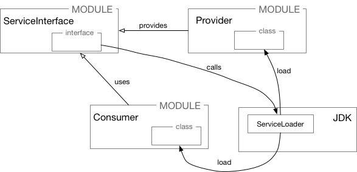

# Modules

## Common

JMOD is alternative to JAR.  The `jmod` command has five possible modes: `create`, `extract`, `describe`, `list`, and `hash`.

`java --list-modules` gives an ability to list all modules in JDK.

For `javac` `-d` option specifies the directory and `-p` option specifies the module path.

The `jdeps` command lists information about dependencies within a module. The `-s` option provides a summary of output rather than verbose output. `--jdkinternals` lists suggestions for used classes from `jdk.unsupported`. Without any command line flags, `jdeps` lists packages and module dependencies. The `jdeps` command outputs `requires mandated java.base` except when run in summary mode.

`‐m` and `‐p` options are on the `java` command. The `javac` command takes `‐p` for the module path rather than `‐m`.

The `‐d` option is a shorthand for `‐‐describe‐module` on both the `jar` and `java` commands.

When running a module, the module name is listed before the slash, and the fully qualified class name is after the slash.

The rules for determining the name of the automatic module include removing the extension, removing numbers, and changing special characters to periods \(.\). Additionally, we remove the version information from the end.

The unnamed module exports all its packages. However, the classes in the unnamed module are only readable by other classes in the unnamed module or from automatic modules. No named module can read the classes of the unnamed module. Code on the classpath has not yet been migrated to modules and can reference any code in the application.

Any `requires` directives must reference unique modules. Using the `transitive` keyword does not change this requirement.

## Migration

A top‐down migration starts by moving all the modules to the module path as automatic modules. Then, the migration changes each module from an automatic module to a named module.

A bottom‐up migration moves each module after all modules it depends on have been migrated.

## Service

Jigsaw allows to build pluggable modules in the following way:



```text
module ServiceInterface {
    exports serviceinterface;
}

module Provider {
    requires ServiceInterface;
    provides serviceinterface.ServiceInterface with serviceprovider.Provider;
}

module Consumer {
    requires ServiceInterface;
    uses serviceinterface.ServiceInterface;
}
```

Another service layout example:

```text
// consumer requires service interface + service locator
modules nature.tree {
  requires nature.sapling;
  requires nature.bush;
}

// service provider
modules nature.tree {
  requires nature.sapling;
  provides nature.sapling.Tree with nature.tree.Maple
}
```

Service provider is not treated as a part of service.

It is logical to combine the service locator and service provider interface because neither has a direct reference to the service provider.

```text
ServiceInterface svc = ServiceLoader.load(SomeService.class).findFirst().get();

// or

ServiceLoader.load(ServiceInterface.class).stream()
        .map(ServiceLoader.Provider::get)
        .collect(Collectors.toList());
```

